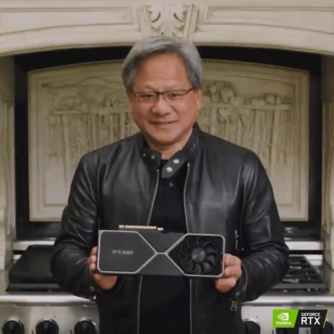
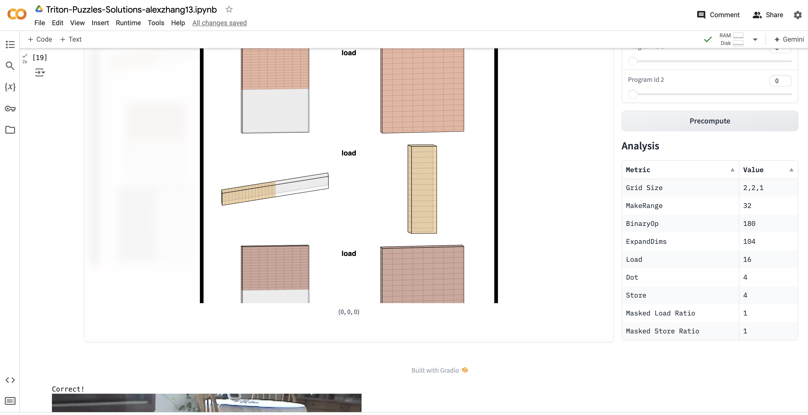

# Triton-Puzzles-Solutions
My own personal solutions to the [Triton Puzzles](https://github.com/srush/Triton-Puzzles) by Sasha Rush and others. Took ~2 days of free time to read through and complete, feel free to use these if you get stuck. Some of my solutions are kind of dirty (and potentially not correct under edge cases) but they pass the (relatively weak) test cases.

I also found the CUDA MODE Discord helpful: https://discord.gg/cudamode #triton-puzzles

  </img>
   
  I was working in Colab...
  </img>

